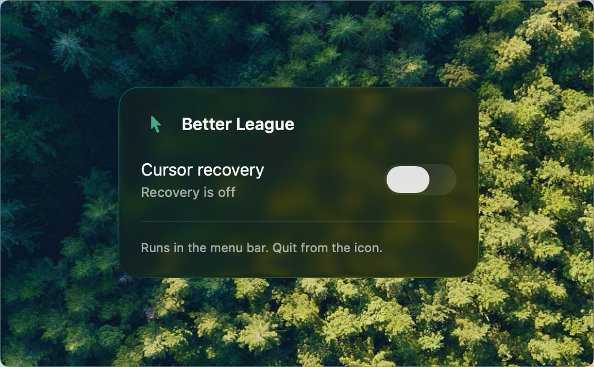

# Better League

A small macOS menu bar app that restores the League of Legends cursor when it turns into the system arrow.

One switch in a native SwiftUI Liquid Glass panel. Hide the window and keep playing.



## Use

1. Open the disk image and drag **Better League** into **Applications**.
2. Launch the app and turn on **Cursor recovery**.
3. Allow **Better League** in **System Settings → Privacy & Security → Accessibility** when prompted. Recovery starts once access is granted.

Use the menu bar icon to turn recovery on or off, show or hide the window, or quit. Drag the panel by its title, and press Escape or Command-W to hide it while recovery keeps running. The app stays out of the Dock and remembers the switch setting between launches. Quitting stops recovery.

If you already run the `lol` command-line guard, stop it with `lol stop` before enabling the app. Only one recovery instance can run at a time.

## Requirements

- macOS 26 or later for native Liquid Glass. The app builds for Apple silicon and Intel; game behavior still needs testing on each setup.
- League of Legends with attack-move targeting bound to the physical **A** key.
- Accessibility permission for Better League.

## How it works

The guard waits for a League match process, estimates full-screen capture from display-coordinate width, and watches cursor changes at a target rate of 240 Hz. After seeing a large game cursor, a switch to a small arrow triggers a brief **A** key press so the game resets its cursor. It retries once after about 450 ms, then backs off if the cursor remains small.

The app uses system input events. It does not read or modify game memory.

### Known limitations

- A recovery during chat or shop search can type `a` into the field. Those interfaces are not detected.
- Cursor detection uses private SkyLight/CGS APIs, which may change with macOS updates.
- Full-screen detection is a width heuristic, not a foreground-app check. Windowed mode, non-Retina displays, multiple displays, and switching apps need further testing.
- Cursor-size thresholds and the recovery key are fixed. Other cursor settings and bindings are not supported yet.

## Build locally

Requires Xcode 26 or later, or matching Command Line Tools with the macOS 26 SDK.

```sh
make build
open '.build/Better League.app'
```

The app uses SwiftUI and AppKit with no third-party dependencies. Local builds use ad-hoc signing. A stable Developer ID signature is recommended when testing Accessibility across rebuilds:

```sh
SIGN_IDENTITY='Developer ID Application: Your Name (TEAMID)' make build
```

### Distribution

```sh
make dist       # Local test DMG and SHA-256 checksum in dist/
make check      # Build, check signatures, and verify the mounted DMG
```

Local disk images are not notarized releases. For Developer ID signing, Apple notarization, and final disk-image verification, see [Distribution](docs/DISTRIBUTION.md).

GitHub Actions builds and verifies the universal app on pushes and pull requests. The separate **Release macOS app** workflow signs, notarizes, verifies, and publishes the version in `resources/Info.plist` when manually started from `main`.

### Command-line development

```sh
make cli
./bin/lol
./bin/lol status
./bin/lol log
./bin/lol stop
```

The app and CLI share the recovery engine and a per-user lock. The CLI wrapper controls `lolrestore` processes; it does not control the app. Its stop command matches processes by name.

For a brief startup check, stop other guard instances first, then run:

```sh
LOLRESTORE_SECONDS=0.2 ./.build/lolrestore
```

This exits before the first match-process check. It verifies startup, not in-game recovery. The command-line tool needs Accessibility permission for the terminal running it.

Logs live in `~/Library/Logs/better-league/lolrestore.log`. They rotate at roughly 3 MiB and retain one `.old` file. Set `LOLRESTORE_MAXLOG` to change the byte threshold. `RESTORED` means a large cursor was detected again; it is not proof of the visual result in a match.

## Source layout

- `src/App/` — window, menu bar, permissions, and saved switch state.
- `src/Core/` — cursor reading, recovery loop, logging, and instance lock.
- `src/CLI/` and `bin/lol` — command-line entry point and controls.
- `resources/` and `scripts/` — app metadata, icon, builds, and distribution.

## License

A license has not yet been specified.
